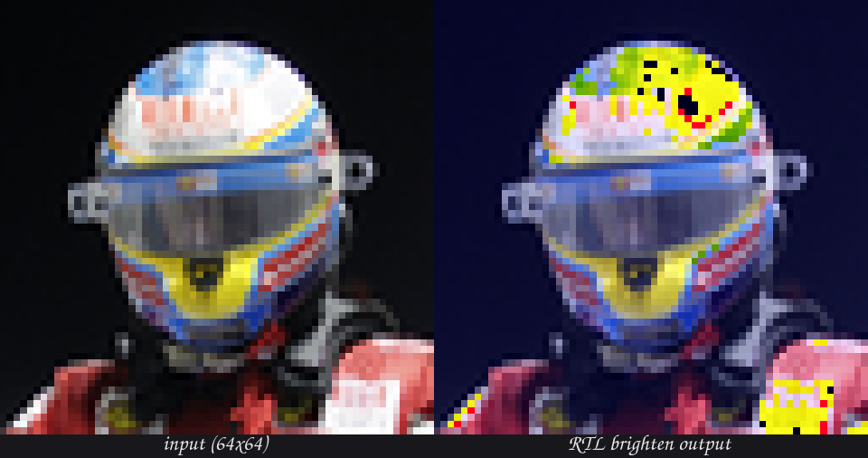
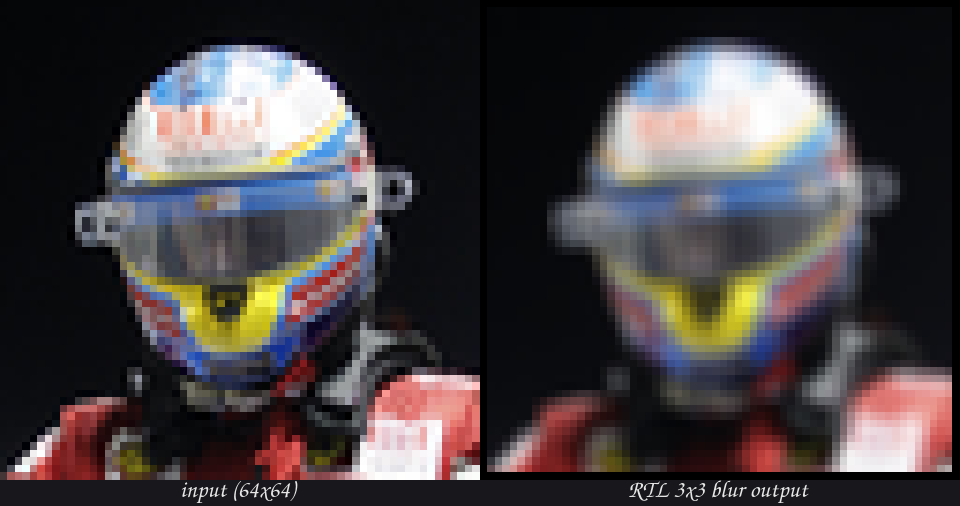

<p align="center">
  
</p>

<h1 align="center">RAPTOR-SoC</h1>

<p align="center">
  A RISC-V System-on-Chip.
</p>

---

## Overview

RAPTOR-SoC is a RISC-V based System-on-Chip project. This repository contains the
hardware design sources, verification environment, and supporting documentation.

## Repository Layout

```
RAPTOR-SoC/
├── docs/            # Documentation and assets (logo)
├── multi_cycle/     # RISC-V multi-cycle CPU (SystemVerilog)
│   ├── rtl/         #   design sources
│   ├── tb/          #   integration testbench
│   └── files.txt    #   Verilator file list
├── simt_gpu/        # SIMT GPU subsystem (SystemVerilog + Python harness)
│   ├── rtl/         #   design sources
│   ├── tb/          #   testbench
│   ├── sw/kernels/  #   device kernels
│   ├── tools/       #   host image <-> memory helpers
│   └── input_images/#   test frames
└── README.md
```

## Subsystems

### `multi_cycle/` — RISC-V Multi-Cycle CPU

Textbook-style multi-cycle RISC-V processor (Patterson & Hennessey) implementing
`ADD, SUB, AND, OR, LW, SW, BEQ`. Self-contained: instruction and data memories
are embedded (64 x 32).

Simulate (from the repository root):

```sh
verilator --binary --timing --top-module tb_riscv_mc \
  -f multi_cycle/files.txt --Mdir /tmp/riscv_mc_obj && \
  /tmp/riscv_mc_obj/Vtb_riscv_mc
```

Expected: `All multi-cycle processor tests passed.`

### `simt_gpu/` — SIMT GPU (Phase 1 + Phase 2 done)

A programmable SIMT accelerator: 2 warps × 4 lanes = 8 physical threads,
custom 16-bit ISA. Larger thread counts run as **waves** (thread blocks): 256
threads = 32 waves of 8. Verified pixel-for-pixel against a Python golden model.
Phase 2 adds the full ALU (`MUL/DIV/AND/OR/XOR/SLL/SRL`), `CMP` + uniform
branches, and the interior 3×3 box blur — all verified pixel-for-pixel (see
`docs/PHASE2_ASSIGNMENT.md`).

<p align="center">
  
</p>

<p align="center"><em>Phase 1 <code>brighten</code> kernel running on the RTL
datapath (4096 threads = 512 waves, 0 mismatches vs the golden model).
The scalar <code>+0x20</code> add overflows blue into green — the speckles
that Phase 2's per-channel saturating math fixes.</em></p>

Phase 2 adds the full ALU (`MUL/DIV/AND/OR/XOR/SLL/SRL`) and a fully-unrolled
interior 3×3 box blur, matched pixel-for-pixel against an independent Python
reference:

<p align="center">
  
</p>

<p align="center"><em>Phase 2 interior <code>blur</code> on the RTL datapath
(3844 threads, 125 instructions, 0 mismatches). The 1-pixel border is
untouched — Phase 3 clamps it.</em></p>


```sh
cd simt_gpu
make build                     # compile the integration testbench
make unit TEST=tb_alu          # run one module unit test
make run                       # brighten: assemble -> golden model -> RTL -> PNG
make blur                      # Phase 2: interior 3x3 box blur
make golden                    # model + reference only, no RTL
make venv                      # optional: Pillow/numpy for images
```

See `docs/GPU_ISA.md`, `docs/BUS_PROTOCOL.md`, `docs/ADDRESS_MAP.md`,
`docs/PHASE1_ASSIGNMENT.md`, and `docs/PHASE2_ASSIGNMENT.md`.

## Progress notes

- `docs/PHASE1_PROGRESS.md`, `docs/PHASE2_PROGRESS.md` — running build logs for
  the Phase 1 and Phase 2 GPU bring-up, written while implementing the RTL.
- `learning/` — accompanying study notes, mission, and lessons generated during
  the build (not part of the hardware design).

## Status

Phase 1 and Phase 2 complete: the SIMT GPU runs `brighten`, `copy`, and the
interior 3×3 `blur` — with the full ALU and uniform branches — all verified
pixel-for-pixel against a Python golden model and an independent reference. The
CPU runs standalone from the riscv repo. A top-level SoC integration (shared
bus, CPU <-> GPU memory + MMIO) is a later phase.

## License

TBD.
